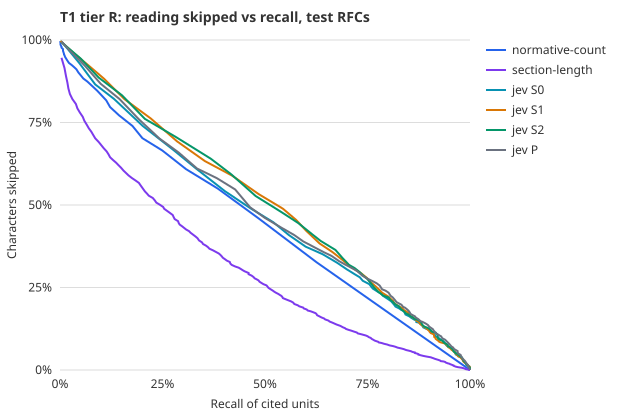
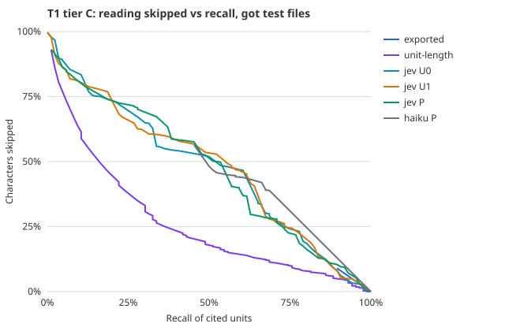

# T1: ingest triage

## 1. Question

Before an agent reads a source to write pages, can a decider pick out the sections worth reading
well enough that skipping the rest loses almost nothing a reader would cite?

## 2. Hypothesis and falsification

Ingest is the expensive phase. An agent reads the whole source, and the 8 RFCs in accreta-atlas
alone are about 423k input tokens (**CITED**: the [model-economist review](../../2026-08-review/06-model-economist.md)). Yet the [constitution](../../../../templates/constitution/base.md)
says most of a source does not deserve a page. If a cheap decider can say which sections do,
the writing model reads only those. The risk is a silent miss: a section skipped is knowledge
the knowledge base never gets, and nothing flags it.

**H1.** At a threshold fixed on separate RFCs, the decider keeps at least 95% of the sections
other RFCs cite, while skipping at least 30% of the text.

- **Refuted** if recall on the test RFCs falls below 95%, or if under 30% of characters are skipped.
- **Demonstrated** only if the lower bound of the recall interval is also at least 90%.

**H2 (descriptive).** Jev compared with Haiku and with two deterministic scores: the count of
RFC 2119 keywords, and section length.

## 3. Pre-registration

- **Label.** A section is **cited** if at least one *other* RFC cites it by number ("Section 4.2
  of RFC 3261", "[RFC3261], Section 4.2"), mined from the whole RFC series
  (`bench/jev/builders/crossrefs.ts`).
  - This is a proxy for "worth a page". Other authors chose these sections to point at, before this
    study existed.
  - The proxy is checked against tier A's ingest labels once they exist.
- **Targets, by rule** (`bench/jev/builders/t1-sections.ts`). RFCs with at least 10 distinct citing
  RFCs, ranked by the number of distinct sections cited; the top 20.
  - The rule on distinct citing RFCs keeps out documents that only a successor cites section by
    section.
  - Sections under 200 characters (bare parent headings) are excluded, as are references,
    acknowledgements and author addresses.
- **Split by RFC** (seed 20261001): 5 calibration RFCs, 15 test RFCs, so no document contributes to both.
- **Levels:**
  - **S0:** the section alone, with RFC and section title.
  - **S1:** S0 plus the RFC abstract.
  - **S2:** S1 plus the RFC's table of contents.
  - **P, packed:** consecutive whole sections of one RFC, up to 60,000 characters, as one state,
    with one question per section. This is the "one document, many questions" shape TypeSafe's
    documentation recommends.
- **Selection.** The level with the best AUROC on the calibration RFCs, with ties going to fewer tokens.
  The test RFCs are scored once at that level; the others are reported as exploratory.
- **Threshold rule.** A section is read when its score ≥ τ. τ is the largest value keeping recall of
  cited sections at or above 95% on the calibration RFCs.
- **Haiku** runs at the selected level. If that level is per-section, it runs on the calibration
  RFCs and a seeded sample of 600 test sections.

### Tier A and tier C (committed before any model sees these units)

**Tier A: RFC 9111 and 6455.** The labels are the baseline ingest's own citations
(`bench/jev/builders/tier-a.ts`): three runs of Claude Opus 5.5 following the constitution.
- **The agent cites almost everything.** 124 of 131 sections are cited in at least one run, 123
  in at least two.
- **The consequence is structural.** Whatever the decider, keeping 95% of the cited sections
  leaves at most about 5% of the sections to skip. No model is run on tier A for T1. The ceiling
  is reported instead, since 7 negatives cannot support an AUROC.
- **The proxy fails.** Tier R's label, "cited by another RFC", agrees with "cited by the ingest
  agent" at Cohen's kappa 0.005. The tier R result stands for what it measures, and says nothing
  about ingest.

**Tier C: got v13.0.0.**
- **Units** (`bench/jev/builders/tier-c-units.ts`): top-level declarations and the members of
  classes and interfaces, at least 3 lines, 213 in all.
- **Label:** cited by the tier C ingest in any run.
- **Split:** a seeded third of the files for calibration (7 files, 25 units), the rest for test
  (14 files, 188 units, 86 cited, 79% of the characters).
- **Levels:** U0, the unit alone; U1, plus the file's outline; P, the file packed, one question per unit.
- **Rules:** the same selection and threshold rules as tier R. Haiku runs at the selected level.
- **Deterministic arms:** whether the unit is exported, and its length.

## 4. Setup

The question, a `noul`:

> Would another specification, or a technical documentation page about this protocol, need to
> cite this section specifically, because it defines a rule, a message or data format, a
> procedure, a value, an error condition or a term that others depend on? Introductions,
> overviews, motivation, examples that only restate other sections, and administrative text are
> not cited this way.

In the packed level, each question is prefixed "About section N ("title") only:".

## 5. Dataset

- **Target RFCs** (distinct sections cited / distinct citing RFCs), calibration marked \*:
  3261 (108/96), 6350 (80/16), 7252\* (75/39), 7231 (72/53), 2616\* (64/46),
  6325 (63/30), 7285 (63/13), 5661 (62/14), 8446 (62/53), 7230 (58/46),
  5280\* (56/102), 4340\* (53/12), 5545 (51/15), 3986 (49/164), 4861 (48/58),
  7296\* (48/28), 3315 (47/55), 4271 (45/49), 6749 (42/28), 3550 (40/71).
- **Calibration:** 5 RFCs, 696 sections, 285 cited.
- **Test:** 15 RFCs, 2,267 sections, 826 cited, about 4.4M characters.

## 6. Metrics and why these

- **Recall of cited sections at τ**, the gated error: a miss is silent.
- **Characters skipped**, the reading saved. This is the number that turns into ingest cost.
- **AUROC**, and the full recall-versus-skipped curve over every threshold.
- **Latency per call and questions per call.** In the packed level one call answers many sections.
- **Cost per 1,000 sections.**

## 7. Results

### What ingest costs, and where

<!-- report:t1-cost -->

Every baseline ingest session, Claude Opus 5.5 through Claude Code. Priced at list rates checked on 2026-09-28; the recomputed total matches the CLI's own report to the cent on eight of nine sessions, and by four cents on the ninth.

| Source | Run | Turns | Cache written | Cache read | Output | Cost, recomputed | Cost, CLI | Share: cache writes | Share: cache reads | Share: output |
| --- | --- | --- | --- | --- | --- | --- | --- | --- | --- | --- |
| RFC9111 | 1 | 22 | 77000 | 477271 | 26386 | $1.24 | $1.24 | 50% | 8% | 43% |
| RFC6455 | 1 | 31 | 113439 | 929773 | 34701 | $1.79 | $1.79 | 51% | 10% | 39% |
| RFC9111 | 2 | 31 | 85337 | 917047 | 27180 | $1.41 | $1.41 | 48% | 13% | 39% |
| RFC6455 | 2 | 42 | 126198 | 1521633 | 41604 | $2.15 | $2.15 | 47% | 14% | 39% |
| RFC9111 | 3 | 31 | 77871 | 872101 | 28310 | $1.36 | $1.36 | 46% | 13% | 42% |
| RFC6455 | 3 | 39 | 126212 | 1520802 | 43592 | $2.19 | $2.19 | 46% | 14% | 40% |
| got source/ | 1 | 60 | 135889 | 3351338 | 50879 | $2.78 | $2.82 | 39% | 24% | 37% |
| got source/ | 2 | 76 | 128101 | 2031703 | 44301 | $2.32 | $2.32 | 44% | 18% | 38% |
| got source/ | 3 | 56 | 113100 | 2063552 | 37806 | $2.07 | $2.07 | 44% | 20% | 36% |

<!-- /report:t1-cost -->

### Tier R

<!-- report:t1-r -->

Test: 15 RFCs, 2,267 sections, 826 cited by another RFC. τ fixed on the 5 calibration RFCs for recall ≥ 0.95. Selected level: **P**. Haiku's test figures come from a seeded sample when it runs per section.

| Arm | AUROC, calibration | AUROC, test | Recall of cited units at τ, test | Units skipped | Characters skipped (reading saved) | Latency p50 per call | Questions per call | Cost per 1,000 units |
| --- | --- | --- | --- | --- | --- | --- | --- | --- |
| normative-count | 0.601 | 0.609 | 100.0% (826/826; 95% CI 99.6%–100.0%) | 0.0% | 0.0% | — | 1 | $0 |
| section-length | 0.686 | 0.657 | 94.1% (777/826; 95% CI 92.2%–95.6%) | 15.0% | 2.3% | — | 1 | $0 |
| jev S0 | 0.669 | 0.634 | 92.7% (766/826; 95% CI 90.7%–94.4%) | 11.0% | 9.3% | 326 ms | 1 | $0.037 |
| jev S1 | 0.660 | 0.668 | 92.0% (760/826; 95% CI 89.9%–93.8%) | 12.1% | 9.1% | 313 ms | 1 | $0.043 |
| jev S2 | 0.633 | 0.646 | 91.6% (757/826; 95% CI 89.5%–93.4%) | 13.3% | 11.3% | 368 ms | 1 | $0.114 |
| jev P **(selected)** | 0.706 | 0.648 | 93.2% (770/826; 95% CI 91.3%–94.8%) | 11.2% | 9.6% | 519 ms | 14 | $0.027 |
| haiku P | 0.526 | 0.500 | 100.0% (826/826; 95% CI 99.6%–100.0%) | 0.0% | 0.0% | 59172 ms | 14 | $2.625 |



<!-- /report:t1-r -->

### Tier C: got

<!-- report:t1-c -->

Test: 14 files of got v13.0.0, 188 declarations, 86 cited by the tier C ingest (79% of the characters). τ fixed on 7 calibration files for recall ≥ 0.95. Selected level: **P**.

| Arm | AUROC, calibration | AUROC, test | Recall of cited units at τ, test | Units skipped | Characters skipped (reading saved) | Latency p50 per call | Questions per call | Cost per 1,000 units |
| --- | --- | --- | --- | --- | --- | --- | --- | --- |
| exported | 0.567 | 0.482 | 100.0% (86/86; 95% CI 95.8%–100.0%) | 0.0% | 0.0% | — | 1 | $0 |
| unit-length | 0.780 | 0.802 | 94.2% (81/86; 95% CI 87.0%–98.1%) | 22.9% | 3.2% | — | 1 | $0 |
| jev U0 | 0.690 | 0.692 | 97.7% (84/86; 95% CI 91.9%–99.7%) | 3.2% | 2.7% | 324 ms | 1 | $0.023 |
| jev U1 | 0.710 | 0.650 | 90.7% (78/86; 95% CI 82.5%–95.9%) | 6.4% | 5.3% | 323 ms | 1 | $0.047 |
| jev P **(selected)** | 0.720 | 0.433 | 95.3% (82/86; 95% CI 88.5%–98.7%) | 3.7% | 5.4% | 553 ms | 2 | $0.012 |
| haiku P | 0.690 | 0.608 | 100.0% (86/86; 95% CI 95.8%–100.0%) | 0.0% | 0.0% | 75669 ms | 2 | $2.335 |



<!-- /report:t1-c -->

## 8. What this does and does not show

**Verdict on the pre-registered hypotheses.**
- **H1, tier R: refuted.** At τ, Jev keeps 93.2% of the cited sections, below the 95% floor, and
  skips about a tenth of the text, below the 30% floor.
- **H1, tier C: refuted.** Recall holds at 95.3%, but only 5.4% of the characters are skipped.
- **H2:** on code, the length of each declaration ranks better than Jev at every level.

- **The tier R label is a proxy that fails.**
  - "Cited by another RFC" agrees with "cited by the ingest agent" at kappa 0.005.
  - The tier R result says Jev cannot predict what other authors cite. It says nothing about ingest.
- **The ceiling is the finding.** The ingest agent cites 95% of RFC sections and code holding 79%
  of the characters. No decider, however good, can skip much of what the writer then uses.
- **Where ingest's money goes.** Cache writes, output and cache reads, in that order (table above).
  The source itself is a minority of the cache writes. This is REASONED from file sizes at about four
  characters per token: RFC 9111 is about 21k tokens, RFC 6455 about 40k, got's `source/` about
  38k, against 77k–136k tokens written to the cache per session. Written once and re-read on every
  turn, the source accounts for roughly a fifth to a quarter of a session's cost. Triage could
  recover at most the share it skips of that fifth: about 5% of it on RFCs, 21% on code at perfect
  recall, and about 5% on code as Jev performed. That is on the order of 1% of the bill.
- **Tier C calibration is too small to select on.** 25 units in 7 files chose the packed level,
  which then scored worst on test. That is the known failure of selecting on a small split, and
  it is reported rather than repaired after the fact.
- **One agent, one model, one constitution.** A leaner writer that cites less would leave more to skip.

## 9. Reproduce

```bash
bun bench/jev/fetch/rfc.ts
rsync -az rsync.rfc-editor.org::rfcs-text-only/ bench/jev/.external/rfc/all/
bun bench/jev/builders/crossrefs.ts
bun bench/jev/builders/t1-sections.ts
wrangler dev --config bench/jev/proxy/wrangler.jsonc --port 8799
bun bench/jev/tasks/run-t1.ts --stage=jev
bun bench/jev/tasks/run-t1.ts --stage=haiku
bun bench/jev/tasks/ingest-atlas.ts        # tier A labels and ingest cost
bun bench/jev/builders/tier-a.ts
bun bench/jev/tasks/ingest-got.ts          # tier C labels and ingest cost
bun bench/jev/builders/tier-c-drift.ts
bun bench/jev/builders/tier-c-units.ts
bun bench/jev/tasks/run-t1-got.ts
bun bench/jev/report.ts
```

## 10. Run log

| Date | Commit | What | Outcome |
| --- | --- | --- | --- |
| 2026-09-28 | `8fb7546` | Cross-references, targets, sections, levels, question and protocol committed | — |
| 2026-09-28 | — | Jev at every level, tier R | Complete. 65 transient Cloudflare `2018` errors, all succeeded on rerun |
| 2026-09-28 | `f824a20`, `474e2ee` | Baseline ingests: 6 sessions over RFC 9111 and 6455, 3 over got | Complete. One got session exited at start because a synchronous clone blocked its stdin; rerun after the harness was fixed |
| 2026-09-28 | `232a279` | Tier C units pre-registered after the unit definition was corrected (a local `const` no longer splits a method) | — |
| 2026-09-28 | — | Tier C: Jev at every level, Haiku at P | P was selected on 25 calibration units and scored worst on test |
