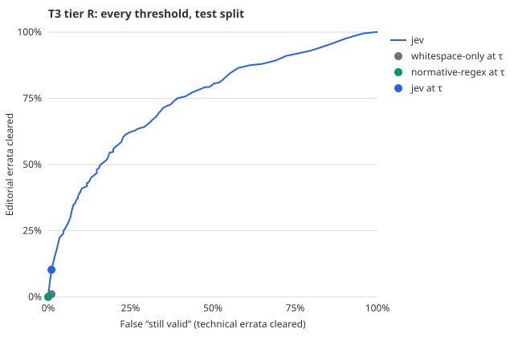

# T3: drift triage

## 1. Question

When a source changes under a cited claim, can a decider tell a change of meaning from a
cosmetic one reliably enough to clear drift without an agent re-reading the source?

## 2. Hypothesis and falsification

Today drift is file-level. Any change to a cited file marks every page that cites it as stale
(`packages/core/src/source/drift.ts`), and the agent then re-reads the source to decide whether the
claims still hold. The [constitution](../../../../templates/constitution/base.md) calls a false
"still valid" the most damaging outcome, because nothing ever flags it again.

**H1.** The decider shows a change of meaning with a false "still valid" rate below 5%, at a
threshold fixed beforehand, while clearing at least 30% of cosmetic changes. If it clears
fewer, it saves too little re-reading to be worth a model call.

- **Refuted** if the false "still valid" rate on the test split is 5% or higher, or if it clears
  fewer than 30% of editorial items at the threshold.
- **Demonstrated** only if the upper bound of the 95% interval is also below 5%.
- **Consistent with** if the point estimate is below 5% but the upper bound is not.

**H2 (descriptive).** Jev is compared with Haiku and with the deterministic arms on the same items,
at the same kind of threshold. No winner is declared on a difference inside overlapping intervals.

## 3. Pre-registration

- **Committed before any model call on these items:** the dataset (`bench/jev/data/t3-errata.json`),
  the question and the protocol (`bench/jev/tasks/t3-errata.ts`). The commit is in the run log below.
- **Threshold rule.** An item is cleared as "still valid" when P(meaning changed) < τ.
  τ is the largest value on a 0.01 grid whose false "still valid" rate on the
  **calibration** split is at most 2%, a margin under the 5% gate. The gate is judged on the
  **test** split only.
- **Sample sizes (tier R).**
  - Calibration: 100 technical, 100 editorial.
  - Test: 400 technical, 400 editorial.
  
  At 400, a 5% error rate carries an interval of about ±2 points.
- **Repeatability.** Jev is asked twice on 50 test items per class, to see whether its answer
  varies. Haiku gets one sample per item.

### Amendment 1: context and question form as factors (committed before any call they make)

The first run gave Jev one level of context: the RFC title and section, plus the two texts. Three
things suggest that level, not the model, may be what limits the result:

- **Small changes are hard for it.** Jev's AUROC falls to 0.66 when fewer than 5% of the words
  change, against 0.74–0.78 otherwise.
- **Its probabilities are poorly calibrated** (ECE 0.147).
- **Jev's own documentation says so.** It advises filtering in code and sending only what the
  question needs.

The first run is kept as it stands, as **L0, minimal context**. It is not "Jev's result".

**Levels** (`bench/jev/tasks/t3-ladder.ts`):

| Level | State |
| --- | --- |
| L0 | RFC, section, original text, corrected text |
| L1 | L0 plus a word-level diff computed in code: each changed span with six words either side |
| L1b | the diff alone, without the full texts |
| L2 | L1 plus the RFC section around the erratum, up to 4,000 characters, from the mirrored RFC text. It is located in 943 of 1,000 items |

**Forms.** The same question is asked as a `noul`, or as a `choice` between *technical* and
*editorial* with the IETF's definitions as the options.

**Selection without forking paths.**
- The configuration (level × form) is chosen by **AUROC on the calibration split only**. Ties go
  to the smaller state.
- τ for that configuration is then fixed on calibration by the original rule, and the test split
  is scored once.
- Every other configuration is also reported on test, labelled exploratory.
- Haiku is run at the selected configuration as well as at L0, so it is compared at the same context.

**L3, the production shape.** accreta's real question is not "did the meaning change?" but
"is *this claim* still true?".
- **Claims.** `bench/jev/builders/claims-t3.ts` has Claude Sonnet 5 write one claim per erratum
  from the original text. The writer sees the changed passage marked, but never the corrected
  text or the label.
- **Sample.** 25 calibration and 100 test items per class. The claims are committed before
  any judge sees them.
- **Question.** "Given the corrected text, is the claim now wrong or no longer supported?"
- **Where it is reported.** Separately from the ladder, since it answers a different question.

**Batching (exploratory, not pre-registered).**
- Jev takes many questions over one state in a single call.
- At the selected level, K = 1, 5, 10 and 25 test items are packed into one state: a shared
  rubric, and one short question per item.
- Measured: the loss in AUROC and in the gated error, tokens per decision, and latency per call
  and per decision.
- Packing unrelated items into one state is what Jev's documentation warns degrades accuracy,
  so this measures the cost of that saving rather than assuming it.


## 4. Setup

**Tier R.** Verified errata from the RFC Editor's errata feed, snapshot of 2026-09-27
(sha256 in `bench/jev/data/snapshots.json`). The IETF classifies each erratum:

- **Technical:** an error in the technical content;
- **Editorial:** a spelling, grammar, punctuation or syntax error that does not affect the
  technical meaning.

That classification is the ground truth. It is also exactly the distinction drift has to make.

An erratum becomes a drift item as follows:

- the erratum's *original text* is the text a page's claim was written from;
- its *corrected text* is what the source now says;
- a Technical erratum is a change that can invalidate a claim;
- an Editorial erratum is one that cannot.

The state given to each decider:

```json
{ "rfc": "RFC9110: HTTP Semantics", "section": "8.8.3", "original": "…", "corrected": "…" }
```

The erratum's notes are withheld: they often say "typo" or explain the error, which would hand
over the label.

The question, asked of Jev as a `noul` and of Haiku as a probability:

> Does the corrected text change the technical meaning of the original text: what an
> implementation must, should or may do, a value, a format or grammar rule, or a described
> behaviour, so that a statement someone wrote from the original text could now be wrong? A
> fix to spelling, grammar, punctuation or layout that leaves the technical meaning unchanged is
> not a change of meaning.

The wording mirrors the IETF's own definition of an editorial erratum, so the decider is asked
what the label means rather than a paraphrase of it.

**Deterministic arms.**

- `whitespace-only`: a change counts if anything other than whitespace differs.
- `normative-regex`: a change counts if the RFC 2119 keywords or the numbers differ. This is
  what a careful rule-writer would try first.

## 5. Dataset

`bench/jev/builders/errata.ts` builds the dataset (seed 20260927).

**Eligible errata.** Verified, Technical or Editorial, both texts present and different, and
together under 8,000 characters. That leaves 1,885 technical and 1,698 editorial.

**Sampling.**
- Per class: shuffled, deduplicated, and capped at two errata per RFC, so that no single document
  dominates.
- The result is 1,000 items across 765 RFCs. The first 100 per class form the calibration split.

**Label noise.** Not every IETF classification is one this study would make. Some Editorial
errata fix a grammar rule's syntax, and five Technical errata differ only in whitespace.
The label noise is measured on an audit sample of 50 items that the maintainer labels blind (see
§7).

## 6. Metrics and why these

- **At τ, for each arm:**
  - the false "still valid" rate, i.e. technical items cleared (the gated error);
  - the clearing rate on editorial items, i.e. how much re-reading is saved.
- The full confusion matrix; never F1.
- AUROC, to see whether the decider ranks at all, independent of τ.
- Brier score and expected calibration error, to see whether its probabilities can be read as
  probabilities.
- Latency p50/p95 and cost per 1,000 decisions.

## 7. Results

### Tier R

<!-- report:t3-r -->

Test split: 400 technical and 400 editorial errata. τ was fixed on the calibration split by the pre-registered rule.

| Arm | τ | False “still valid” (technical cleared) | Editorial cleared (re-reading saved) | AUROC | Brier | ECE | Latency p50 / p95 | Cost per 1,000 | Errors |
| --- | --- | --- | --- | --- | --- | --- | --- | --- | --- |
| whitespace-only | 0.99 | 1.0% (4/400; 95% CI 0.3%–2.5%) | 1.0% (4/400; 95% CI 0.3%–2.5%) | 0.500 | — | — | — | $0 | 0 |
| normative-regex | 0.00 | 0.0% (0/400; 95% CI 0.0%–0.9%) | 0.0% (0/400; 95% CI 0.0%–0.9%) | 0.566 | — | — | — | $0 | 0 |
| jev | 0.04 | 1.0% (4/400; 95% CI 0.3%–2.5%) | 10.3% (41/400; 95% CI 7.5%–13.6%) | 0.740 | 0.231 | 0.147 | 341 / 477 ms | $0.023 | 0 |

Confusion matrix at τ, test split:

| Arm | Technical → flagged | Technical → cleared ✗ | Editorial → flagged | Editorial → cleared |
| --- | --- | --- | --- | --- |
| whitespace-only | 396 | 4 | 396 | 4 |
| normative-regex | 400 | 0 | 400 | 0 |
| jev | 396 | 4 | 359 | 41 |

Repeatability: Jev asked twice on 100 test items. Median |Δp| 0.010, max 0.100; the decision at τ flipped on 2 of 100.



<!-- /report:t3-r -->

## 8. What this does and does not show

_To be completed with the results._

## 9. Reproduce

```bash
bun bench/jev/fetch/rfc.ts            # errata feed and index, hash-checked
bun bench/jev/builders/errata.ts      # rebuilds data/t3-errata.json exactly
wrangler dev --config bench/jev/proxy/wrangler.jsonc --port 8799   # holds the Cloudflare credentials
bun bench/jev/tasks/run-t3.ts
bun bench/jev/report.ts
```

## 10. Run log

| Date | Commit | What | Outcome |
| --- | --- | --- | --- |
| 2026-09-27 | `22b934c` | Dataset, question, protocol committed | — |
| 2026-09-27 | — | Jev (L0) and deterministic arms, all 1,000 items | Complete. 9 calls failed with a transient Cloudflare `2018` error and succeeded on rerun |
| 2026-09-27 | `971a0ee` | Blind audit sample drawn (30 per class) after the run showed label noise | — |
| 2026-09-27 | — | Haiku (L0) and the Opus 5.5 second annotator started | Paused by the maintainer at 416 and 84 of 1,000; resumed from the cache |
| 2026-09-28 | _amendment 1_ | Context ladder, question forms, L3 and batching committed before their calls | — |
